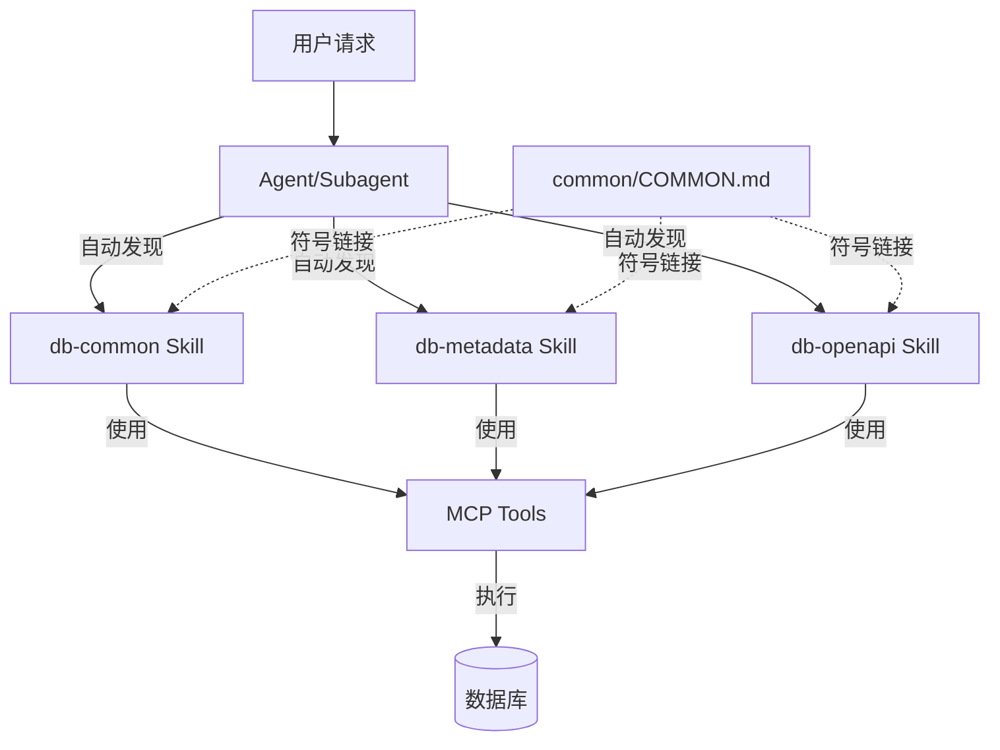

# Blacklake Plugin 设计文档

## 一、设计理念

### 1.1 定位

**Blacklake Plugin** 是公司内部运维辅助工具插件，专注于：
- 🔍 **工作流问题排查和诊断**：快速定位工作流执行问题
- ⚙️ **连接器配置管理**：生成和管理 API 连接器配置
- 📊 **平台数据统计分析**：多维度数据分析
- 🗄️ **数据库查询和操作**：提供标准化的数据库查询能力

### 1.2 核心设计原则

基于 [Claude Code 官方文档](https://claude.com/blog/skills-explained) 的最佳实践：

#### 原则1：分层架构（Agent → Skills → MCP Tools）

```
User Request
    ↓
Agent (业务逻辑编排)
    ↓
Skills (程序性知识)
    ↓
MCP Tools (执行)
```

**职责划分**：
- **Agent 层**：业务逻辑编排者，专注于特定运维场景
- **Skill 层**：程序性知识提供者，教 Claude "如何做"
- **MCP Tools 层**：执行者，执行具体的操作

#### 原则2：Skills 提供程序性知识

根据官方文档，Skills 应该提供：
- ✅ **程序性知识**（Procedural knowledge）：如何执行任务
- ✅ **工作流程**：步骤化的执行指南
- ✅ **查询模板**：可复用的 SQL 模板
- ✅ **最佳实践**：专业领域的经验总结

#### 原则3：Skills 自动发现机制

**官方机制**：
- Skills 存储在 `.claude/skills/` 或项目的 `skills/` 目录
- Claude **自动发现**和**动态加载** Skills
- 使用**渐进式披露**：
  - 元数据先加载（~100 tokens）
  - 完整指令按需加载（<5k tokens）
  - 文件和脚本按需加载

**Agent 与 Skills 的关系**：
- ✅ Agent 在文档中**说明**相关 Skills
- ✅ Claude **自动发现**并使用相关 Skills
- ❌ **不需要**在 frontmatter 中显式配置
- ❌ **不需要**Agent 显式调用 Skills

#### 原则4：Skills 自包含原则

**官方建议**：
- ✅ 每个 Skill 应该是独立的、自包含的模块
- ✅ Skill 所需的所有文件应放在技能目录内
- ✅ 保持低耦合，提高可移植性

**实现方式**：
- 使用符号链接保持 `COMMON.md` 的一致性
- 每个 Skill 目录包含完整的资源
- 避免跨目录的直接依赖

## 二、架构设计

### 2.1 组件关系



### 2.2 数据流

```
用户请求
  ↓
Agent 理解任务
  ↓
Claude 自动发现相关 Skills
  ↓
加载 Skills 的程序性知识（工作流程、模板）
  ↓
Agent 使用 Skills 中的方法执行任务
  ↓
调用 MCP Tools 执行具体操作
  ↓
返回结果给 Agent
  ↓
Agent 整合结果并输出
```

## 三、Skills 设计

### 3.1 Skills 列表

| Skill | 数据库 | 主要功能 |
|-------|--------|---------|
| db-common | 通用 | 查询工作流程、SQL 模板、结果分析 |
| db-user | v3_user | 租户和组织信息查询 |
| db-openapi | v3_openapi | 连接器和 API 配置查询 |
| db-metadata | v3_metadata | 对象编码、按钮、事件配置查询 |
| db-e-report | v3_e-report | 数据分析告警配置查询 |

### 3.2 Skills 结构

每个 Skill 包含：
- `SKILL.md` - 技能定义文件（必需）
- `COMMON.md` - 通用规范（符号链接到 `common/COMMON.md`）

**SKILL.md 标准结构**：
```markdown
---
name: db-common
description: ...
---

# 技能名称

## 【通用规范】
参考：[通用规范](./COMMON.md)

## 【查询工作流程】
1. 确定查询目标
2. 选择查询方法
3. 执行查询
4. 结果分析

## 查询模板
...
```

### 3.3 COMMON.md 管理

**方案**：使用符号链接保持一致性

```bash
# 创建符号链接
cd skills/db-common
ln -s ../../common/COMMON.md COMMON.md
```

**优势**：
- ✅ 单一数据源，易于维护
- ✅ 保持 Skills 自包含
- ✅ 符合官方最佳实践

## 四、Agents 设计

### 4.1 Agents 列表

| Agent | 来源 | 使用的 Skills | 主要功能 |
|-------|------|--------------|---------|
| workflow-troubleshooter | op-workflow | db-common | 工作流排查和诊断 |
| connector-registrar | op-connector | db-common, db-openapi, db-user | 连接器配置 SQL 生成 |
| platform-analyst | op-statistics | db-common, db-metadata, db-e-report, db-user, db-openapi | 平台数据统计分析 |
| button-configurator | op-button | db-common, db-metadata | 按钮配置 SQL 生成 |
| event-configurator | op-event | db-common, db-metadata | 事件配置 JSON/SQL 生成 |

### 4.2 Agent 标准结构

```yaml
---
name: workflow-troubleshooter
description: ...
model: sonnet
color: blue
---

# Agent 名称

## 【相关 Skills】

执行任务时，Claude 会自动发现并使用以下 Skills：

- **db-common**: 提供数据库查询工作流程...

## 【核心职责】
...

## 【工作流程】
...
```

### 4.3 Agent 设计要点

**✅ 应该做的**：
1. 在文档中明确说明相关 Skills
2. 专注于业务逻辑和任务编排
3. 提供清晰的工作流程
4. 明确职责边界和限制

**❌ 不应该做的**：
1. 在 frontmatter 中使用 `skills` 字段（不存在）
2. 重复 Skills 中的查询模板
3. 包含具体的 SQL 语句（应该在 Skills 中）
4. 显式调用 Skills（Claude 会自动发现）

## 五、与 op-plugin 的改进对比

### 5.1 架构改进

| 方面 | op-plugin | blacklake_plugin |
|------|-----------|------------------|
| COMMON.md | 每个目录独立 | 统一管理，符号链接 |
| Agent 职责 | 包含查询模板 | 只包含业务逻辑 |
| Skills 职责 | 只有查询模板 | 包含工作流程和模板 |
| Skills 说明 | 缺少 | Agent 文档中明确说明 |

### 5.2 内容重组

| 内容 | op-plugin 位置 | blacklake_plugin 位置 |
|------|---------------|---------------------|
| 通用规范 | 每个 Agent | common/COMMON.md |
| SQL 查询模板 | Agent 中 | db-common skill |
| 对象映射表 | op-button.md | db-metadata skill |
| 事件查询模板 | op-event.md | db-metadata skill |
| 工作流程 | 缺失 | Skills 中 |

### 5.3 命名改进

| op-plugin | blacklake_plugin |
|-----------|-----------------|
| op-workflow.md | workflow-troubleshooter.md |
| op-connector.md | connector-registrar.md |
| op-statistics.md | platform-analyst.md |
| op-button.md | button-configurator.md |
| op-event.md | event-configurator.md |

## 六、实施细节

### 6.1 符号链接设置

**macOS/Linux**：
```bash
cd skills/db-common
ln -s ../../common/COMMON.md COMMON.md
```

**Windows**：
```powershell
cd skills\db-common
New-Item -ItemType SymbolicLink -Path COMMON.md -Target ..\..\common\COMMON.md
```

### 6.2 验证方法

1. 检查符号链接是否正确：
   ```bash
   ls -la skills/db-common/COMMON.md
   # 应该显示指向 ../../common/COMMON.md
   ```

2. 验证 Agent 文档中的 Skills 引用
3. 验证所有文件路径正确

## 七、最佳实践总结

### 7.1 Skills 设计

- ✅ 提供程序性知识（如何做）
- ✅ 包含工作流程、模板、最佳实践
- ✅ 自包含，可独立使用
- ✅ 自动发现，动态加载

### 7.2 Agents 设计

- ✅ 专注于业务逻辑和任务编排
- ✅ 在文档中说明相关 Skills
- ✅ 不重复 Skills 的内容
- ✅ 通过文档引导使用 Skills

### 7.3 协作方式

- ✅ Claude 自动发现 Skills
- ✅ Agent 文档引导使用
- ✅ 不需要显式配置
- ✅ 保持低耦合

## 八、参考资源

- [Claude Code Skills 官方文档](https://claude.com/blog/skills-explained)
- [Claude Code 最佳实践](https://claude.com/blog/building-skills-for-claude-code)
- [op-plugin 问题分析文档](../op-plugin/ISSUES.md)
- [版本管理说明](../../VERSION_MANAGEMENT.md)

